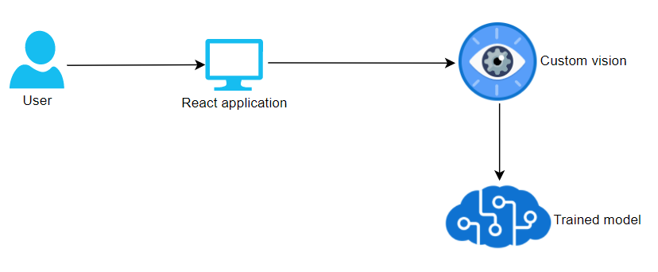

# Mask recognizer sprawozdanie

## Use case

Mask recognizer to aplikacja webowa, która umożliwa ropoznanie czy osoba na zdjęciu ma maseczkę czy jej nie ma oraz podaje prawdopodobieństwo udzielonej odpowiedzi. Do aplikacji wsyatrczy zupload'ować zdjęcie z dysku a następnie nacisnąć przycisk "Check if person has mask on".

## Wykonane kroki w celu utworzenia aplikacji

1. Stworzenie resource group'y
2. Stworzenie zasobu custom vision w utworzonej resource groupie 
3. Stworzenie projektu na [customvision.ai](https://www.customvision.ai/)
4. Zdobycie zbioru danych twarzy ludzi bez maseczek oraz z maseczkami i zuploadowanie ich do [customvision.ai](https://www.customvision.ai/)
5. Wytrenowanie modelu na [customvision.ai](https://www.customvision.ai/)
6. Stworzenie aplikacji react'owej do której można uploadować zdjęcie i która uderza na endpoint wystawiony przez [customvision.ai](https://www.customvision.ai/) by sprawdzić czy dana osoba na zdjęciu ma maseczkę

## Architektura aplikacji

## Zreprodukowanie aplikacji

1. Założenie resource groupy
2. Stworzenie resource'a Custom Vision w resource groupie
3. Zalogowanie się do strony customvision.ai naszym kontem
4. Stworzenie projektu w utworzonej resource groupie na stronie customvision.ai
5. Zuplodowanie dowolnej ilości obrazków (np. około 400) z tagiem **mask** z folderu [images_with_mask](MaskRecognizer/images_with_mask)
6. Zuplodowanie dowolnej ilości obrazków (np. około 200) z tagiem **no_mask** z folderu [images_without_mask](MaskRecognizer/images_without_mask)
7. Wytrenowanie modelu
8. Skopiowanie Predction-Key oraz Prediction-URL z sekcji "If you have an image file"
9. Podmiana Prediction-Key oraz Prediction-URL w pliku [config.json](MaskRecognizer/mask-recognizer/src/config.json)
10. Zainstalowanie aplikacji reactowej komendą **npm install** będąc w katalogu [mask-recognizer](MaskRecognizer/mask-recognizer)
11. Uruchomienie aplikacji reactowej komendą **npm start** będąc w katalogu [mask-recognizer](MaskRecognizer/mask-recognizer)

## Link do dema

https://youtu.be/wf2s4euEIkY