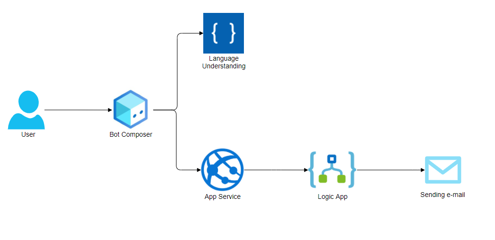

# Computer Bot Sprawozdanie

## Use case

Computer bot to bot komputerowy, który pomaga nam złożyć zamówienie zestawu komputerowego. Bot po otrzymaniu kodu zestawu komputerowego przeprowadza nas przez proces zamówienia, a następenie wysyła potwierdzenie zamówienia wraz z podsumowaniem na podanego mail'a podczas zamówienia. Dokładne działanie bocia na przykładzie zostało przedstawione na demie.

## Wykonane kroki w celu utworzenia bota

1. Stworzenie projektu w bot composerze
2. Stworzenie resource groupy wraz z usługą LUIS na platformie Azure
3. Podpięcie usługi LUIS do bot composer'a
4. Napisanie konkretnych dialogów (dialog pomocy, dialog powitalny, dialog pozwalający nam zamówić zestaw komputerowy wraz z różnymi przeplotami, dialogi obsługujące błędy) w bot composerze oraz dodanie obsługi LUIS'a.
5. Stworzenie aplikacji backend'owej wraz z 2 endpointami. Jeden z nich informuje nas o podzespołach komputera dla konkretnego kodu zestawu komputerowego wraz z zamockowanymi danymi. Na drugi natomiast są wysyłane wszystkie informacje dotyczące zamówienia (by później poszedł request z tego miejsca do Logic App'a).
6. Stworzenie Logic App'a który otrzymuje informacje dotyczące zamówienia w request'cie POST i wysyłya maila wraz z podsumowanie na maila klienta
7. Podpięcie wykonania requesta z aplikacji backendowej do Logic App'a
8. Zdeployowanie aplikacji backendowej do Azure'a
9. Podpięcie endpointów zdeploywanej aplikacji backendowej oraz Logic App'a do bot composer'a

## Architektura bota

## Zreprodukowanie bota

1. Wdrożenie szablonu resource group'y na Azure'a. Szablon resource group'y znajduje się w pliku resource-group-template.json
2. Zuatoryzowanie się w Logic App'ce przy użyciu istniejącego mail'a lub podając nowy.
3. Podmiana linku do Logic Apki w aplikacji Javowej. Link znajduje się w klasie APIController.java.
4. Deploy Aplikacji Javowej do Azure'a. Najłatwiejszy sposób to przy pomocy Azure CLI oraz maven'a. Na początku w terminalu wywołujemy 'az login' by się zalogować do portalu Azure, a następnie będąc w katalogu projektowym deploy'ujemy projekt komendą mvn com.microsoft.azure:azure-webapp-maven-plugin:1.12.0:config. Żeby to się powiodło trzeba posiadać Javę w wersji 11 lub wyższej. Więcej informacji o deploy'u tym sposobem: https://docs.microsoft.com/pl-pl/azure/app-service/quickstart-java?tabs=javase&pivots=platform-windows.
5. Otworzenie projektu bota przy użyciu Bot Composer'a.
6. Podmiana linku do App Service'a w dwóch miejscach: BuyComputer->BeginDialog (2 dialogi wykonujące requesty).
7. Bot powinien się uruchomić i działać poprawnie po naciśnięciu start Emulator. W przyszłości można bota zdeploy'ować do Azure'a i np. połączyć z usługą messenger'a tak by bot był dostępny np. na Facebook'u.

## Link do dema

https://www.youtube.com/watch?v=UmVHIiCvJ3A